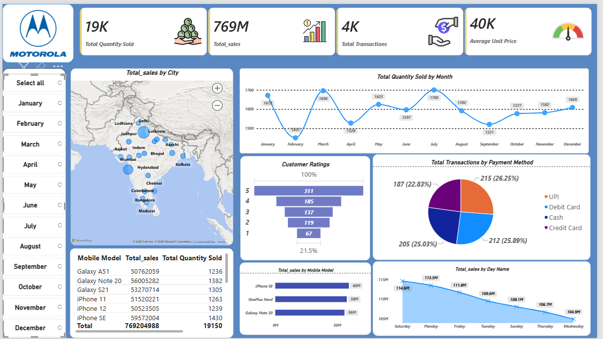

# Mobile Sales Dashboard | Power BI

An interactive Mobile Sales Dashboard created using Microsoft Power BI to analyze sales performance, transactions, customer ratings, payment methods, mobile models, cities, and time-based trends.

## 📊 Dashboard Preview

## 📌 Project Overview

This project was created as part of my Data Analytics learning journey using the Skill Course by Sathish Dhawale.

The dashboard provides an interactive view of mobile sales data and helps analyze sales performance across different dimensions such as city, month, mobile model, payment method, customer rating, and day of the week.

## 📈 Key Metrics

- Total Quantity Sold: 19K
- Total Sales: 769M
- Total Transactions: 4K
- Average Unit Price: 40K

## 🔍 Dashboard Analysis

The dashboard includes:

- Total Sales by City
- Total Quantity Sold by Month
- Customer Ratings
- Transactions by Payment Method
- Sales by Mobile Model
- Sales by Day of the Week
- Mobile Model-wise Sales and Quantity
- Monthly and city-level analysis using interactive filters

## 🛠️ Tools & Skills

- Microsoft Power BI
- Power Query
- DAX
- Data Visualization
- Data Cleaning
- Dashboard Design
- Data Analysis
- Interactive Filters & Slicers

## 🎯 What I Learned

Through this project, I practiced:

- Creating interactive Power BI dashboards
- Using DAX measures for calculations
- Working with Power Query for data transformation
- Creating different types of visualizations
- Using slicers and filters for interactive analysis
- Presenting business data in a clear and understandable way

## 📂 Project Files

| File | Description |
|------|-------------|
| `Mobile_Sales_Dashboard.pbix` | Power BI dashboard file |
| `Mobile_Sales_Data.xlsx` | Excel source data used for the dashboard |
| `dashboard-preview.png` | Preview image of the dashboard |

## 📚 Learning Source

This project was created while learning Power BI through the Skill Course by Sathish Dhawale.

## 🚀 About Me

I am currently learning Data Analytics and building projects to strengthen my practical skills in Power BI, SQL, Excel, Python, and data visualization.

I am continuing to build projects and improve my skills as I work towards a career in Data Analytics.
